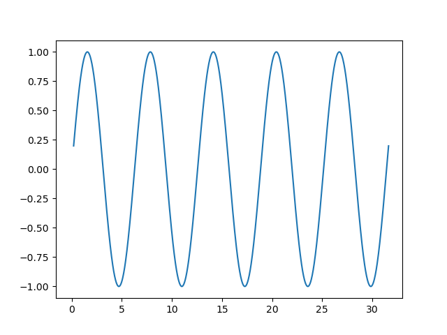

# Sine Wave Animation
This Python script generates an animated plot of a sine wave using matplotlib.  The wave appears to move horizontally as the animation updates the x-values and recalculates the sine values in real time. This file serves as template code for creating math animations with matplotlib.

---

## Table of Contents
- [Overview](#overview)
- [Requirements](#requirements)
- [Installation](#installation)
- [Usage](#usage)
- [Example / Screenshots](#example--screenshots)
- [How It Works](#how-it-works)
- [License](#license)

---

## Overview

This Python script demonstrates a **real-time animated sine wave** using `matplotlib`. The animation:

- Generates a sine wave over a range of x-values.
- Updates the x-values and recalculates the sine values in real time to create a moving wave effect.
- Uses `matplotlib.animation.FuncAnimation` to render the animation frame by frame.
- Can optionally save the animation as a GIF for sharing or embedding.
- Serves as a template for creating mathematical or scientific animations in Python.

---

## Requirements
- python==3.11.11
- matplotlib==3.10.0
- numpy==1.26.4

## Installation
git clone https://github.com/mnmarinaccio/SineWaveAnimation.git  
cd SineWaveAnimation

You can install the dependencies with:  
pip install -r requirements.txt

## Usage
Open the notebook in Jupyter and run all cells  
jupyter notebook SineWaveAnimation.ipynb

## Example / Screenshots

## How It Works

1. **Wave Setup**
   - Define a range of x-values using `numpy.linspace`.
   - Compute the initial sine values for these x-values.

2. **Animation Function**
   - Use `matplotlib.animation.FuncAnimation` to update the plot frame by frame.
   - For each frame, the x-values are shifted horizontally to create the moving wave effect.
   - Recalculate the sine values for the updated x-values.

3. **Rendering**
   - Update the line plot with the new x and y values at each frame.
   - The animation runs for a set number of frames with a specified interval between them.

4. **Visualization and Saving**
   - Display the animated sine wave using `matplotlib.pyplot.show()`.
   - Optionally save the animation as a GIF using the Pillow writer.

## License
This project is licensed under the Apache 2.0 License. See the LICENSE file for details.
